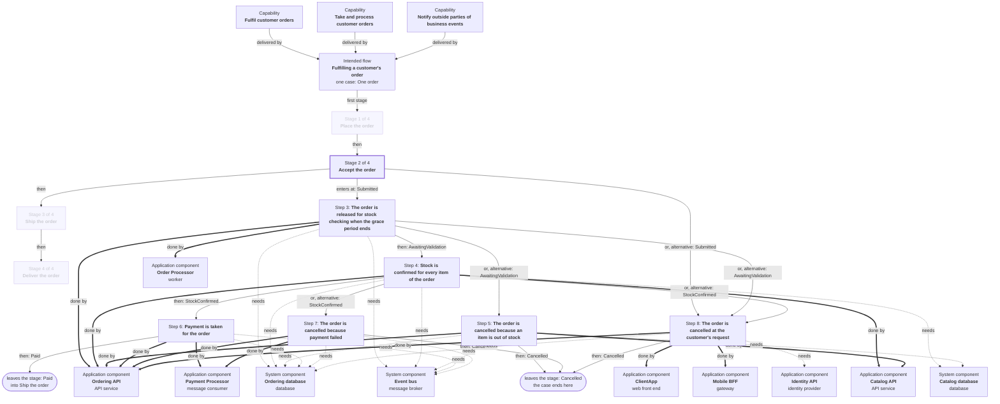

# Fulfilling a customer's order: stage 2 of 4, Accept the order

**How to read it.** Solid arrows between steps follow the case: each is labelled with the state the case is in when the next step starts. Where several arrows leave one step, they are alternatives: one case takes one of them. **Done by** is every part that carries the step out; **needs** is a part it cannot complete without that does not itself carry the step out. Step numbers are the register's, and every other output uses the same ones.

