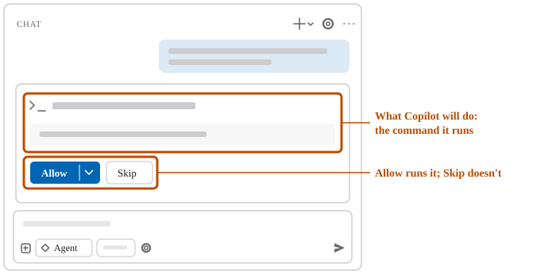
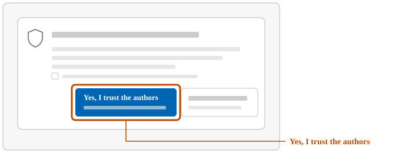
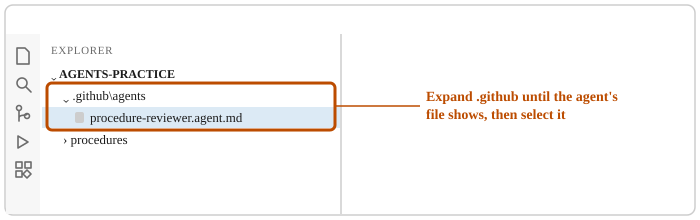
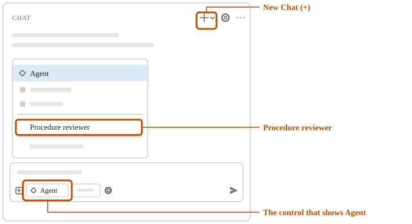

# Create your first custom agent

A reviewer that can only read files can check your documents and leave every one as written. In
this unit, you have Copilot create practice procedures and a Procedure reviewer custom agent. You
use it to check the procedures, and then ask it to change one.

## 1. Have Copilot create practice procedures

Copilot creates procedures to practice on, in a new folder.

1. In the chat box, enter:

> Create a new folder named agents-practice in the folder Windows uses as my Documents folder, which may be under OneDrive.
> If agents-practice already exists, don't change it; tell me instead.
> In it, create a folder named procedures with three short, made-up office procedures.
> Give each procedure numbered steps, with one unclear step and one step left out.
> Add or change no other file.

2. If a permission request appears, allow it if it matches what you asked.

In the drawings, gray bars stand for text that differs on your screen.

3. On the **File** menu, select **Open Folder**. In the window that opens, go to Documents, the same Documents that File Explorer shows on the left. Select `agents-practice`, and then **Select Folder**.
4. If VS Code asks whether you trust the authors of the files, leave the box about the parent folder unticked, and then select **Yes, I trust the authors**.

5. If a bar at the top says the folder is in Restricted Mode, select **Manage**, and then **Trust**.

Check: the list on the left shows `AGENTS-PRACTICE`, with `procedures` in it, and a control at the bottom of the chat box shows **Agent**.

<!-- more: If no control shows Agent -->
If no control there says **Agent**, or the controls show only icons, select the chat box, hold down Ctrl, and press the period key (.). The list of agents opens, with the selected agent highlighted. Select **Agent**.
<!-- /more -->

## 2. Have Copilot create the Procedure reviewer

You describe the role, and Copilot writes the custom agent's file.

1. Enter:

> In the agents-practice folder, create the custom agent file .github/agents/procedure-reviewer.agent.md.
> In its header, set the name to Procedure reviewer.
> Set the tools in its header to read and search only.
> Set its description to: Check procedures for unclear or missing steps, without changing them.
> In its instructions, have it quote each unclear step and say why, and name each missing step.
> In its instructions, also have it give the file name of the procedure for each step.
> If that file already exists, don't change it; tell me instead.
> Add or change no other file.

2. If a permission request appears, allow it if it creates only that file.
3. In the list on the left, expand `.github` until `procedure-reviewer.agent.md` shows, and select it.

Check: the header's `name` line says Procedure reviewer, and its `tools` line lists `read` and
`search` only. `edit`, the tool that changes files, isn't there.

**Important:** this custom agent is saved in the agents-practice folder, so it works only while
that folder is open in VS Code. To have a custom agent in every folder, ask Copilot to save it in
your personal agents folder instead.

## 3. Select the Procedure reviewer

While it's selected, Copilot works in its role, with only its tools.

1. At the top of the chat, select **New Chat** (+).
2. At the bottom of the chat box, select the control that shows **Agent**, and then select
   **Procedure reviewer**.

Check: the control shows **Procedure reviewer**.

<!-- more: If Procedure reviewer isn't in the list -->
See [A custom agent isn't in the list of agents](../troubleshooting.md#a-custom-agent-isn-t-in-the-list-of-agents).
<!-- /more -->

## 4. Have the Procedure reviewer check the procedures

You ask in one line; its instructions say how to report.

1. Enter:

> Check the procedures in the procedures folder.

Check: the reply quotes unclear steps and names missing ones, each with the file name of its procedure. In the list on the left, expand `procedures`, and select the file the reply names for one quoted step. Find that step in it.

## 5. Ask the Procedure reviewer to change a procedure

The reviewer has no tool to make the change you ask for.

1. Enter:

> Rewrite the unclear steps in the procedures so they're clear.

2. If a permission request to change a file appears anyway, select **Skip**.

Check: Copilot says it can't change the files, or shows new wording in the chat only. Open the procedure file you opened to check the reply: the step you found there is unchanged.

## On your own work

For a kind of review you do often, ask Copilot to create a custom agent for it. Tell Copilot to use
your checklist as its instructions, and to give it only the tools that read files.

## What you did

You had Copilot create a custom agent that can only read files. You selected it, used it to check
the procedures, and saw that it couldn't change them.

Source: [Custom agents in VS Code](https://code.visualstudio.com/docs/agent-customization/custom-agents), Microsoft.
