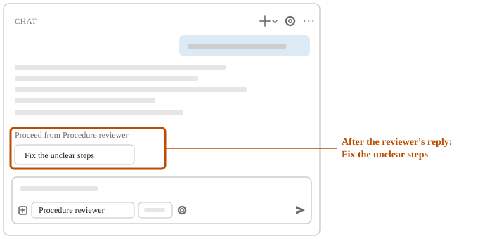

# Hand a review to Agent to fix

**You end with:** a Procedure reviewer that shows a button after each review. The button hands
what the reviewer found to **Agent** to fix. You also end with practice procedures whose unclear steps **Agent** fixed.

**You need:** the agents-practice folder open in VS Code, with the Procedure reviewer and the
procedures folder in it. If another folder is open, on the **File** menu, select **Open Recent**, and then select
`agents-practice`.

**When:** a second agent works from what a first agent produced, and you want to read that before
the second agent starts.

A handoff is a button that a custom agent shows after its reply. Selecting it switches to another
agent and fills in a request for that agent.

## 1. Have Copilot add a handoff to the Procedure reviewer

Copilot adds the handoff to the reviewer's file. With `send` set to false, the request the button
fills in waits in the chat box until you send it.

1. Select **New Chat** (+). If the control at the bottom of the chat box doesn't show **Agent**,
   select the control, and then select **Agent**.
2. Enter:

> In the agents-practice folder, open .github/agents/procedure-reviewer.agent.md.
> In its header, add a handoffs list with one handoff.
> Set the handoff's label to: Fix the unclear steps
> Set the handoff's agent to agent, in lowercase.
> Set the handoff's prompt to: Rewrite the unclear steps listed above so they're clear. Add or change no other file.
> Set the handoff's send to false.
> Add or change no other file.

3. If a permission request appears, allow it if it changes only that file.
4. In the list on the left, select `procedure-reviewer.agent.md`.

Check: the header has `label: Fix the unclear steps` and
`agent: agent`, and the `tools` line still lists `read` and `search` only.

## 2. Have the Procedure reviewer check the procedures

1. Select **New Chat** (+). Select the control that shows **Agent**, and then select
   **Procedure reviewer**.
2. Enter:

> Check the procedures in the procedures folder.

Check: when the reply finishes, a button that says **Fix the unclear steps** shows below it, under
**Proceed from Procedure reviewer**.

<!-- more: If no button appears -->
Select the control that shows **Procedure reviewer**, select **Agent**, and enter:

> Rewrite the unclear steps listed above so they're clear.
> Add or change no other file.

If a permission request appears, allow it if it changes only files in the procedures folder. Then
do the Check under "Hand the review to Agent".
<!-- /more -->

## 3. Hand the review to Agent

1. Select **Fix the unclear steps**. The control now shows **Agent**. The chat box holds the
   handoff's request. Read the request, and then press Enter to send it.
2. If a permission request appears, allow it if it changes only files in the procedures folder.

Check: pick one unclear step in the reviewer's reply. Open the procedure it names, and find that
step. Its wording has changed, and it reads more clearly than the quote.

If it does not work: [Help](../../troubleshooting.md).
