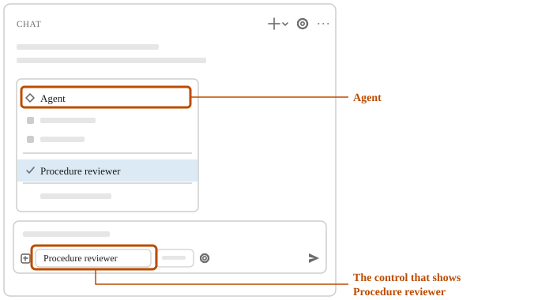

# Make a custom agent's reports consistent

A report laid out the same way every time is quicker to read and to check. In this unit, you have
Copilot add a report layout to the Procedure reviewer's instructions. Then you ask for two reviews
in different words and get the same layout. Start with the agents-practice folder open, as
[Create your first custom agent](create-your-first-custom-agent.md) left it.

## 1. Have Copilot add a report layout to the Procedure reviewer

The reviewer can't change its own file, so you use **Agent**.

1. At the top of the chat, select **New Chat** (+).
2. At the bottom of the chat box, select the control that shows **Procedure reviewer**, and then select
   **Agent**.

3. Enter:

> In the agents-practice folder, open .github/agents/procedure-reviewer.agent.md.
> At the end of its instructions, add this report layout:
> - A heading "Procedures checked", then the file name of each procedure checked.
> - A heading "Unclear steps", then a table with the columns Procedure, Step and Why.
> - A heading "Missing steps", then one line for each missing step, naming its procedure, or "None" if there are none.
> Add or change no other file.

4. If a permission request appears, allow it if it changes only that file.
5. In the list on the left, select `procedure-reviewer.agent.md`.

Check: the instructions end with the three headings in that order, and the `tools` line still
lists `read` and `search` only.

## 2. Have the Procedure reviewer check the procedures

A custom agent's instructions apply to every request while it's selected.

1. Select **New Chat** (+).
2. At the bottom of the chat box, select the control that shows **Agent**, and then select
   **Procedure reviewer**.
3. Enter:

> Check the procedures in the procedures folder.

Check: the reply has the headings Procedures checked, Unclear steps and Missing steps, in that
order, with a table of Procedure, Step and Why under Unclear steps.

## 3. Ask the Procedure reviewer in other words, and compare the layout

The layout comes from the custom agent, not your wording.

1. Select **New Chat** (+), and select **Procedure reviewer** again if the control doesn't show it.
2. Enter:

> Which steps in the procedures folder would confuse someone doing them for the first time?

Check: the reply has the same three headings in the same order, and the same table columns. Open the file named in one table row, and find the step it quotes.

<!-- more: If the layout differs -->
Copilot may not have used the custom agent's instructions. Check that the control shows
**Procedure reviewer**. To have Copilot find out why and fix the file, select the control, then **Agent**, and enter:

> Review .github/agents/procedure-reviewer.agent.md in the agents-practice folder.
> Tell me why the Procedure reviewer didn't use its report layout.
> Fix the file so it does.
> Add or change no other file.
<!-- /more -->

## On your own work

When you want a custom agent's reports laid out the same way each time, ask Copilot to add the
layout to its instructions. Say the headings, in order, and what goes under each.

## What you did

You had Copilot add a report layout to a custom agent, and got that layout from two requests
worded differently. To go back to **Agent**, select the control at the bottom of the chat box, and
then select **Agent**.

Source: [Custom agents in VS Code](https://code.visualstudio.com/docs/agent-customization/custom-agents), Microsoft.
