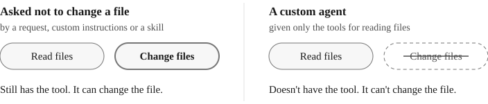
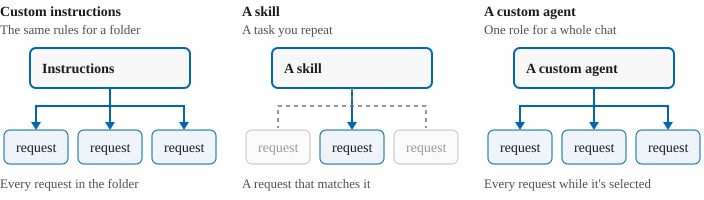

# What is a custom agent?

A custom agent is Copilot set up for one role, such as reviewer or planner. It has its own
instructions, the tools it may use and, if you choose, its AI model.

In this unit, you learn what a custom agent is and when to use one. There's nothing to do in VS
Code yet.

## Why use a custom agent

A skill holds one task, such as a weekly summary. A custom agent covers a role, for as long as you
have it selected. When you want Copilot in the same role often, select a custom agent instead of
describing the role in every request. Each one gets what its role needs:

- A reviewer holds your review checklist.
- A planner has only the tools for reading files, so it can work out a change but not make it.
- A procedure writer holds your template and house rules, and keeps every tool.

Copilot does its work with tools: one tool reads a file, another changes a file, another runs a
command. A custom agent's tools come with it: while it's selected, Copilot has only those tools.

- Custom instructions or a skill can only ask Copilot not to change a file. Copilot still has every
  tool, including the one that changes files.
- A custom agent can be given only some of the tools. Without the one that changes files, it
  can't change a file, even if a request asks it to.



In [Create your first custom agent](create-your-first-custom-agent.md), you build a reviewer that
has only the tools for reading files. It lists unclear steps in your procedures and leaves the procedures unchanged.

A custom agent can also hand its work on. After the reviewer replies, a button can pass its
findings to **Agent** to fix. **Agent** is the agent you've used so far. The practice recipe
[Hand a review to Agent to fix](how-to/hand-a-review-to-agent.md) shows how to add that button.

## What a custom agent looks like

A custom agent is a Markdown file whose name ends in `.agent.md`. You don't type one yourself:
when you ask, Copilot writes the whole file. This one, `procedure-reviewer.agent.md`, checks
procedures:

```
---
name: Procedure reviewer
description: Check a procedure for unclear or missing steps, without changing it.
tools: ['read', 'search']
---

Read the procedure I name.
List each step that is unclear or missing, and say why.
```

- The header, between the two `---` marks, gives the agent's name, what it does and its tools.
- `read` and `search` let it read and search the files in the folder you have open. `edit`, the
  tool that changes files, isn't listed.
- The agent's instructions follow the header.

## How you select a custom agent

A custom agent you create is added to the list that opens from the control showing **Agent**. The list may
show other agents too; you can leave them alone. While a custom agent is selected, the control
shows its name.

## Custom instructions, a skill or a custom agent?



- **Custom instructions:** for Copilot to follow the same rules in every request in a folder. Copilot uses them
  with every request while the folder is open.
- **A skill:** for Copilot to do a task you repeat the same way each time. Copilot uses it when a request
  matches its description, or when you select it after typing `/`.
- **A custom agent:** for Copilot to work in one role, such as reviewer or planner, for a whole chat. Copilot
  uses it while you have it selected in the chat box.

For something you need only once, say it in the request. Often more than one would work: choose
the smallest change that does the job. The home page's
[Which to use when](../README.md#which-to-use-when) compares these with connections too.

Which would you use for each of these? Decide, and then select **Show the answer**.

a. Everything Copilot writes in a folder should spell out abbreviations.

b. Each week, you ask Copilot to check the new procedures against a style guide and fix their wording to match.

c. Each new procedure needs checking for missing steps. It must stay unchanged while it's checked, even if a request asks Copilot to fix it.

d. You write new procedures several times a week. In each of those chats, you want Copilot to work
as a procedure writer, from your template and house rules.

e. One procedure needs checking for missing steps, just this once.

Check your answer:

- **a. Custom instructions.** It's a rule for every request in the folder.
- **b. A skill.** It's one task you repeat the same way. A custom agent working as an editor would
  also do it, but that's a bigger change than the task needs.
- **c. A custom agent.** Each procedure must stay unchanged even if a request asks for a fix. A
  skill can only ask; a reviewer without the tool that changes files can't change the procedure.
- **d. A custom agent, or a skill.** For a whole chat in one role, a custom agent: you select it
  once. A skill also works if you ask for one procedure at a time.
- **e. None of them.** Say it in the request.

## What you learned

A custom agent is Copilot set up for one role. It's a `.agent.md` file: a header, then its
instructions. The header gives its name, a description, its tools and, if you choose, its AI model.
You select it in the chat box. Use one for a role you need often. Its tools come with it, every
time you select it.

Source: [Custom agents in VS Code](https://code.visualstudio.com/docs/agent-customization/custom-agents) and [Understand agent customization](https://code.visualstudio.com/docs/agents/concepts/customization), Microsoft.
