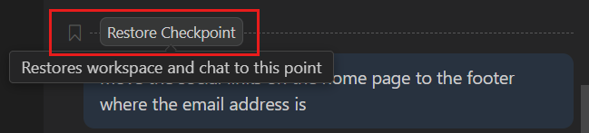

# Change Copilot's work, then undo it

Copilot can carry out a task that takes several actions, and you can change the result by asking
again. In this unit, you give it one task, change the result with a follow-up, and undo the change.
Start with the practice folder open and the chat set to **Agent**, as at the end of
[Make your first request to Copilot](start-here.md).

## 1. Have Copilot write meeting notes and an action list

1. In the chat box, enter:

> In the copilot-practice folder, create a folder named notes.
> In it, write three short, made-up notes from a weekly team meeting.
> Each note lists what was decided, and the actions with an owner and a due date.
> Then create actions.md beside the notes folder: a bulleted list of every action, with its owner, its due date and the note it came from.
> Add or change no other file.

2. If a permission request appears, allow it if it matches what you asked.
3. In the list on the left, right-click `actions.md` and select **Open Preview**.

Check: `notes` holds three files, and `actions.md` lists actions, each with an owner, a due date
and the note it came from.

<!-- more: About the files Copilot made -->
Your notes and actions are worded differently from anyone else's. A file ending in
`.md` is a Markdown file: plain text with simple marks for headings and lists. **Open Preview**
shows it formatted. The preview updates when the file changes.
<!-- /more -->

## 2. Ask Copilot to turn the action list into a table

A follow-up builds on the last request, so it can be short.

1. Enter:

> Make the actions in actions.md a table, sorted by due date.

Check: the preview of `actions.md` shows a table, earliest due date first.

## 3. Undo the table

Restore Checkpoint undoes the edits Copilot made with a request, so it's safe to try things.

1. In the chat, hover over your last request, the one about the table, and select **Restore
   Checkpoint**.

2. Confirm that you want to restore it.

Check: `actions.md` is a list again, as it was before the table.

<!-- more: What undo does and doesn't take back -->
Restoring a checkpoint puts the files back as they were before that request and removes the
request from the chat. It can't undo a command Copilot
already ran; that's why Copilot asks first.
<!-- /more -->

## On your own work

You can do this with your own files. On the **File** menu, select **Open Folder**, and choose the
folder. Then give Copilot a task in plain words: what to read, what to make, and where to put it.

<!-- more: Word and PDF files, and getting back here -->
Word and PDF files aren't plain text, so Copilot may ask to run a small command to read them. If it
reads the file you named, allow it. To get back to the practice folder, on the **File** menu, select
**Open Recent**.
<!-- /more -->

## What you did

You gave Copilot a task, changed the result with a follow-up, and undid the change.

Screenshot: Visual Studio Code documentation, Microsoft, CC BY 3.0.
