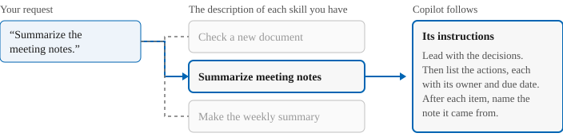
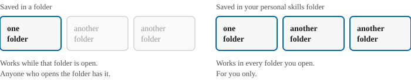
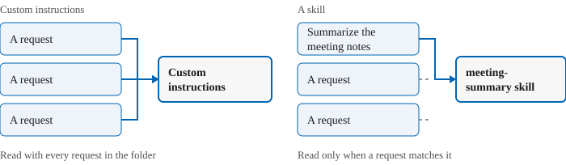

# What is a skill?

A skill is a saved set of instructions for one kind of task. You write the instructions once, and
Copilot follows them when you ask for that task, so you don't type them again.

## Why use a skill

Some tasks you ask for again and again, and want done the same way each time:

- a weekly summary in the same layout
- the same checks on every new document

Without a skill, you type the full instructions every time, and the result changes when your
wording does. With a skill, you ask in a few words, and Copilot follows the saved instructions.

## What a skill looks like

A skill is a folder holding a Markdown file named `SKILL.md`. This one summarizes meeting notes:

```
---
name: meeting-summary
description: Summarize meeting notes for busy, non-technical readers. Use when asked to summarize meeting notes.
---

Lead with the decisions. Then list the actions, each with its owner and due date.
After each item, name the note it came from.
```

- The lines between the two `---` marks are the skill's header: its name and its description.
- After the header come the skill's instructions.

## How Copilot uses a skill

Copilot checks the description of each skill you have. When your request matches a skill's
description, such as "summarize the meeting notes", Copilot follows that skill's instructions.
That's why a description says both what the skill does and when to use it.



You can also run a skill by name: type `/` in the chat box, and select the skill from the list.

## Where a skill works

A skill saved in a folder works only while that folder is open in VS Code, and anyone who opens
that folder has it. A skill saved in your personal skills folder works in every folder you open,
for you only. Copilot saves a skill in either place when you ask.



## Skills and custom instructions

In the Getting started unit [Give Copilot custom instructions for a folder](../getting-started/custom-instructions.md), you saved rules for summaries as custom
instructions. Copilot read them with every request while the folder was open. Instructions saved
as a skill are read only when you ask for that task. That means they never change Copilot's
answers to anything else, and you can keep one skill for each task you repeat.



The home page's [Which to use when](../README.md#which-to-use-when) shows where skills fit beside
custom instructions, custom agents and connections.

## What you learned

A skill is a folder with a `SKILL.md` file: a header that says what the skill does and when to use
it, then the instructions. Copilot uses it when a request matches its description, or when you
select it with `/`.

Source: [Use Agent Skills in VS Code](https://code.visualstudio.com/docs/agent-customization/agent-skills), Microsoft.
